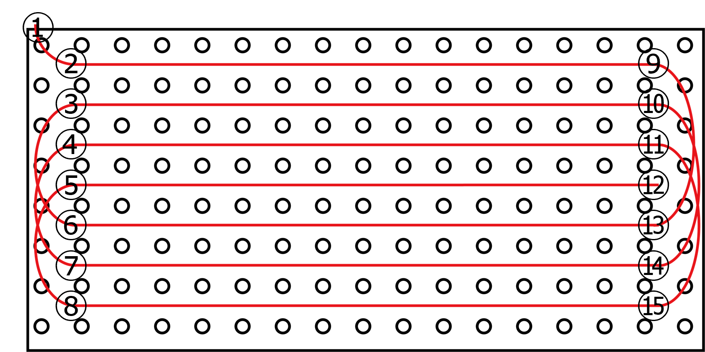

# Fiber-RADGET
## Introduction
Fiber-RADGET is a distributed fiber optic sensor structured on a spiral film to sense underground strain in response to plant root growth. This repository stores sample data, signal processing, and plant visualization codes written in MATLAB.
## Sample data description
- Configs/*_650um_gages.mat: each file contains ```gages``` which is an array of indices for gages of a distributed fiber optic sensor corresponding to the following positions in a Fiber-RADGET device.

- Configs/Fiber-RADGET_dim_*.mat: parameters describing the shape of Fiber-RADGET.<br />
- Configs/CT_dim_*.mat: Coefficients to convert X-ray image parameters to physical values.<br />
- Abiotic: Real-time measurements of microstrains for every fiber optic sensor gage. The measurement was taken 20 times per second while a metal wire was penetrated at the center of a pot filled with glass beads.<br />
- Plants: Real-time measurements of microstrains for every fiber optic sensor gage. The measurement was taken every 10 minutes while a plant seed was sown at the center of a pot filled with soil at time 0.
## How to use
For MATLAB codes, you need to purchase a license from [MATHWORKS](https://matlab.mathworks.com/) and Optimization Toolbox.
- Download the input files and place it in an arbitrary directory (i.e. ```~/Sample/.```).<br />
- Open the main script, either RadgetAll1.m for rice root visualization or RadgetAll2.m for radish root visualization.<br />
- Edit lines in IO specification to match the sample of your interest. Set ```videoS``` to ```true``` to export time-series fiber optic sensor measurements as a video.<br />
- Press F5 to run the main script.<br />
## Version used
MATLAB 9.14.0.2337262 (R2023a) Update 5
